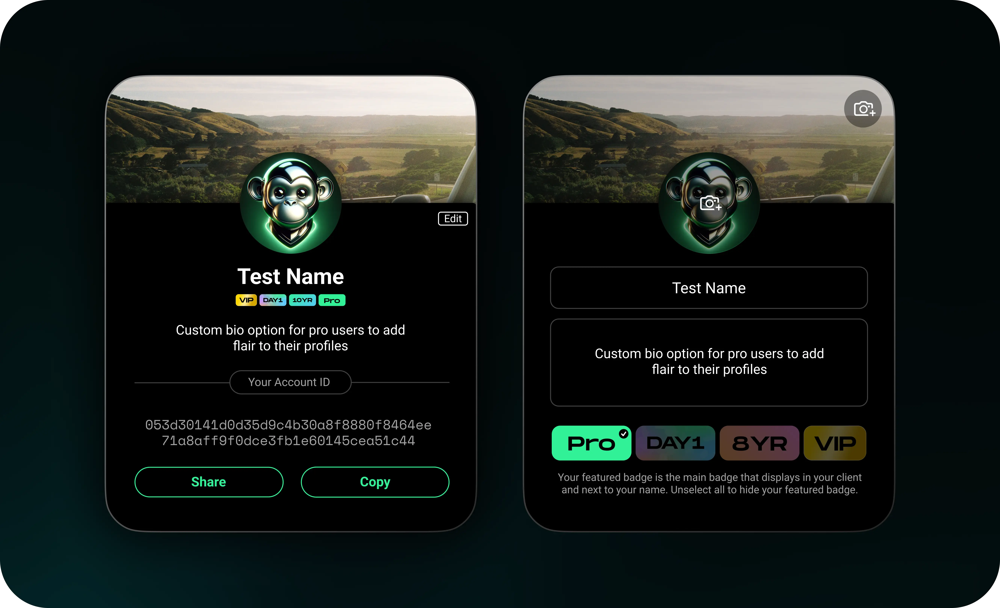

# Session Pro

Session Pro is a service offering advanced features to power users of Session. \
\
A beta version of Pro will be released first as an MVP. The initial feature set for Session Pro Beta is yet to be announced, but will be focused on additional convenience features for users, allowing them to better organize their messages on Session, exceed limits placed on free users and offer more opportunities to customize how they appear to other users in the app. \
\
Planned features for the full version of Session Pro include, but are not limited to:

* Increased file transfer limits
* Account Profiles
* Badges

Many of these are intensive features requiring additional storage and computational resources from the Session Network.&#x20;

<figure><figcaption>
A UI mock-up of the Session Pro 'flair'. This is a preliminary mock-up and not indicative of the final product.
</figcaption></figure>

Therefore, it would not be sustainable for the network to offer these features for free to all users (seeing as Session does not store, collect, or monetize user data in any way); however, they can be unlocked for a fee. Thus, Pro features are unlocked by paying Session Network Fees.

While additional Session Pro features are in discovery, it is important to note that security and privacy features as well as existing Session features will remain freely provided.

### Fees 

Session Network Fees are paid by burning Session Tokens. These Session Tokens, minus transaction fees, are then re-minted into the Staking Reward Pool, sustaining the network for its work storing and validating information.&#x20;

### Oracle pricing

End users expect Session Pro to have:

* A consistent cost
* A cost denominated in either their local fiat currency or a major fiat currency

To facilitate this, Session Network Fees are dynamically calculated using on-chain oracles. Although Session Network Fees must always be paid in Session Token (SESH), the actual amount of tokens required to unlock Session Pro varies such that the ‘dollar cost’ remains stable.

All Session Pro unlocks require Network Fees to be paid in Session Token(s). However, additional third party payment gateways will be available, allowing users to purchase Session Pro with fiat or crypto, which will then be converted to Session Tokens and deposited into the pool on behalf of the user.

### Payment gateways

Session Token is always required to unlock Session Pro features. However, other payment options can be offered through use of swapping systems and services.

For ease of use, users at point of sale can purchase Session Pro using fiat in-app payment gateways (such as through Google Play and the App Store), or using cryptocurrencies other than Session Token.

These will then be swapped into Session Token, which is used natively to pay Session Network Fees and unlock Session Pro.

These services will require third-party management of your access to Session Pro, although users may always manage Session Pro using their own Session Tokens, wallet, and Session application.
