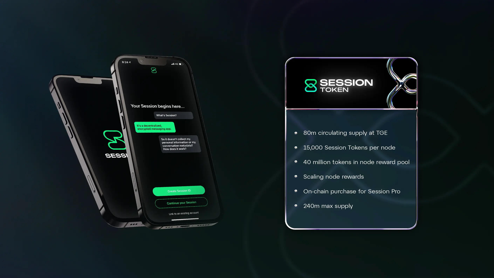

# Session Token (SESH)

<mark style="background-color:green;">**Session Token staking and rewards contracts will be deployed on Arbitrum One.**</mark>

Session Token is an EVM-compatible token utilised in the Session ecosystem to unlock premium features in Session messenger and as a security and incentivization layer for Session Nodes.

It is the core of the Session ecosystem, enabling the decentralized network that powers Session messenger. Session Token offers a new model for bootstrapping and growing a communications overlay network which prioritizes user privacy while remaining sustainable.

### What can I do with Session Token (SESH)?&#x20;

As the native cryptocurrency of the Session ecosystem, Session Token can be used to stake to Session Nodes, reward nodes for validating transactions and storage for Session messenger, and unlock, access, or interact with advanced features within Session messenger (such as Session Pro unlocks and Session Names).

<figure><figcaption>
Session Token at a glance
</figcaption></figure>

***

### Get started

|                                                        |                                         |                                       |                                                     |
| ------------------------------------------------------ | --------------------------------------- | ------------------------------------- | --------------------------------------------------- |
| [Session Token FAQs](https://token.getsession.org/faq) | [Session Token Tokenomics](tokenomics/) | [Rewards Programs](rewards-programs/) | [Get Session Token (SESH)](get-session-token-sesh/) |
