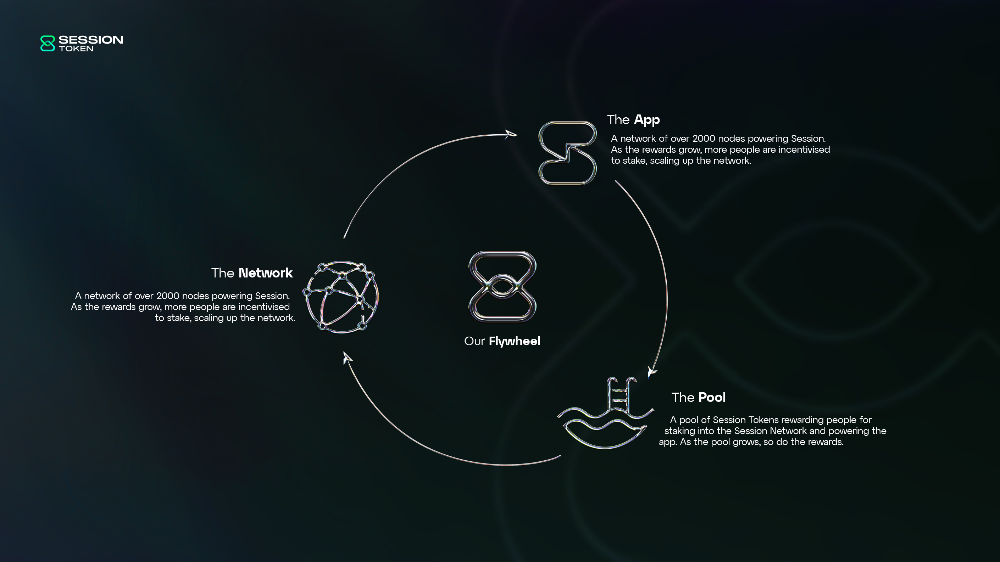

# Tokenomics

The maximum supply of Session Token is 240,000,000. At token genesis, the circulating supply will be a maximum of 80,000,000 Session Tokens.

Session Token is a utility token intended to be used within the Session application and for Session Network purposes. This page provides a summary of Session's tokenomic principles.

Head to [**Genesis Tokenomics**](genesis-tokenomics.md) to learn more about the supply, lockups, and overall tokenomics at TGE.

### Token Flow

When Session Token is utilized to unlock advanced features ([Session Pro](../../session-messenger/advanced-features/session-pro.md), [Session Names](../../session-messenger/advanced-features/session-names-and-the-session-name-service-sns/)) or for network security (staking), Session Tokens flow out of circulation.

When Session Token is utilised for incentivization (network rewards), Session Tokens flow into circulation.

Session Token’s tokenomic system is designed to create flow conditions such that:

* Session Token is effective for use in-app by millions of users;
* Session Token is viable to stake for node operators and contributors;
* Session Token is an effective incentive for good, honest node behaviour.

<figure><figcaption></figcaption></figure>

### Session Network Fees

When a user unlocks access to Session Pro, registers a Session Name, or uses other advanced features, they pay Network Fees in Session Tokens (SESH). These dynamic fees are designed to compensate the network for the additional validation and storage required to facilitate these features.

Network Fees are burnt and reminted back to the ecosystem.

90% of fees are reminted into the[ Staking Reward Pool](https://docs.getsession.org/staking-reward-pool), directly rewarding Session Nodes in the network for their validation and storage.

<figure><figcaption></figcaption></figure>

The remaining 10% becomes protocol-owned liquidity to ensure market liquidity and scalability.

<figure><figcaption></figcaption></figure>

Initially, this 10% will be deployed to a Uniswap pool. This will continue for a minimum period of 5 years from TGE.

This scheme will be reviewed after a 5 year period to ensure its efficacy, in case of emergency (e.g. _Uniswap security breach_), these funds would be able to be removed and/or reallocated to other liquidity provisions.

### Staking Reward Pool

The Staking Reward Pool is the ecosystem’s core mechanism for providing incentives to the network (Session Node operators and contributors).&#x20;

Tokens in the pool are time-locked in a smart contract and released at a targeted rate of 14% per year. The tokens released are awarded to active and registered nodes in the Session Network.&#x20;

At TGE, the Staking Reward Pool will have 40,000,000 Session Tokens.

#### Dynamic rewards

As the Staking Reward Pool releases tokens using a percentage rate (rather than an absolute rate), real rewards vary based on the amount of tokens in the pool.&#x20;

If the amount of tokens in the pool increases, the real rewards (in SESH) returned to active network participants also increase. Similarly, if the amount of tokens in the pool decreases, the real rewards (in SESH terms) given to the network also decrease.

The network’s reward is equally shared by all registered and active nodes, so the amount of real rewards (in SESH) an individual node receives also depends on the size of the network.

The equation for calculating the reward for any node on a given day is as follows:

$$
\dfrac{0.151(Staking Reward Pool)}{365 \times Network Size}
$$


For more information about the Staking Reward Pool, check out the [Staking Reward Pool page](../../session-network/staking/staking-reward-pool.md)


