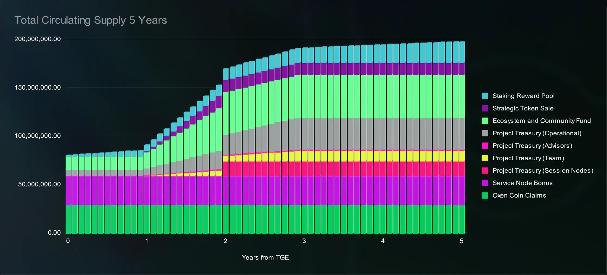

# Genesis tokenomics

<figure><figcaption></figcaption></figure>

Although Session Token has a maximum supply of 240,000,000, a **maximum of&#x20;**<mark style="background-color:green;">**80 million**</mark>**&#x20;Session Tokens are unlocked at TGE.**

* 6 million for Project Treasury (7.5% TGE supply)
* 14 million for the Ecosystem and Community Fund (17.5% TGE supply)
* 60 million from [Session Token Swap Program ](https://token.getsession.org/blog/session-token-swap-program)(75% TGE supply)

***

The remaining 160,000,000 are subject to varying lockup conditions. The following lockup conditions may apply:

Lockup A: Staked

Tokens are time-locked using a smart contract for 24 months following TGE. Tokens in this smart contract can be staked for participation in the Session Node Network. Rewards earnt through active staking are, as per usual, immediately accessible.

Lockup B: Linear

Tokens are time-locked using a smart contract for 24 months following TGE. Tokens in this smart contract cannot be staked. 12 months following TGE, a 12 month linear unlock begins at a rate of 8.33% claimable per month.

Lockup C: Unlocked

Tokens are distributed at TGE with no associated lockups or restrictions.

Lockup D: Long term commit

Tokens are time-locked using a smart contract for 3 years following TGE. Tokens in this smart contract cannot be staked. 12 months following TGE, a 24 month linear unlock begins (at a rate of 4.16% claimable per month). When these tokens are allocated to any team member, there are performance and operational requirements which must be met before tokens are received.

Lockup E: Staking Reward Pool

Tokens are locked in a smart contract and released at a rate of 14% per year (recalculated per block). The rate of 14% is calculated relative to the total amount of Session Tokens in the Staking Reward Pool, and new Session Tokens may be added to the pool.

**The following table describes which tokens (total 240,000,000) are subject to which lockup condition:**

| Category                                    | Session Tokens | Lockup Condition                                                                                          | Description                                                                                                                                                                                                                                                                                       |
| ------------------------------------------- | -------------- | --------------------------------------------------------------------------------------------------------- | ------------------------------------------------------------------------------------------------------------------------------------------------------------------------------------------------------------------------------------------------------------------------------------------------- |
| **Oxen Coin Claims**                        | 30,000,000     | C                                                                                                         | Tokens reserved for those who participate in the Oxen Coin Claims program.                                                                                                                                                                                                                        |
| **Service Node Bonus**                      | 30,000,000     | C                                                                                                         | Tokens earned by Oxen Service Nodes during the network transition period.                                                                                                                                                                                                                         |
| **Project Treasury (Session Nodes)**        | 15,000,000     | A                                                                                                         | This allocation is held by the project alongside operational funds. It may only be used for operating up to 10% of the Session Node network. Public disclosure statements must be made if these tokens are used for any other reason. Rewards received from operating nodes do not remain locked. |
| **Project Treasury (Session Contributors)** | 11,000,000     | D                                                                                                         | This allocation is used to reward existing and new Session contributors and demonstrate long-term commitment to the project. In total this is a conditional 3 year lockup term.                                                                                                                   |
| **Project Treasury (Advisors)**             | 1,000,000      | B                                                                                                         | Locked for the first 12 months from TGE, then distributed evenly after the 12 month period. This is conditional, based on performance and contributions.                                                                                                                                          |
| **Project Treasury (Operational)**          | 33,000,000     | 
C: 6m (18.18%) D: 27m (81.82%)
                                                                  | These tokens are for the operation of the project.                                                                                                                                                                                                                                                |
| **Ecosystem and Community Fund**            | 44,000,000     | 
B: 30m (68.18%) C: 14m (31.81%)
                                                                 | These tokens are specifically to be used to strengthen the Session community and bolster the Session ecosystem over time.                                                                                                                                                                         |
| **Strategic Token Sale**                    | 36,000,000     | 
A/B: 12m (34.72%) TBD: 24m (65.27%)  <em>Lockup terms TBD but will be similar to A/B</em>
 | This amount is reserved for sale before TGE to strategic parties which can help grow Session. Unsold tokens will be put into the Staking Reward Pool, Lockup E.                                                                                                                                   |
| **Staking Reward Pool**                     | 40,000,000     | E                                                                                                         | To reward Session Nodes for securing and providing services to the Session Network.                                                                                                                                                                                                               |

Additional Session Tokens will enter circulation over time as their lockup periods expire. However, Session Tokens will be locked in the [Staking Reward Pool ](../../session-network/staking/staking-reward-pool.md)via mechanisms such as [Session Pro](../../session-messenger/advanced-features/session-pro.md) and removed from circulation via [staking](../../session-network/session-nodes/staking-and-collateralization.md), making it is difficult to predict the future values for circulating supply.

Below is a graph which shows the supply over 5 years _without_ considering tokens locked in the Staking Reward Pool and via staking.&#x20;

<figure><figcaption></figcaption></figure>

