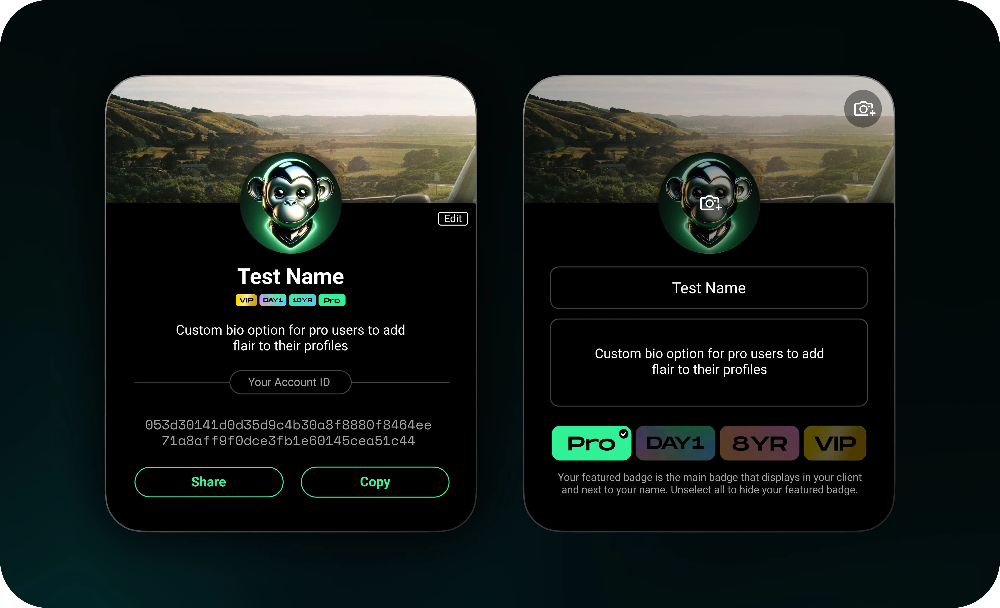

# Session Pro

Session Pro is a subscription service offering advanced features to power users of Session. All subscriptions require Session Tokens to flow into the pool. However, additional third party payment gateways will be available, allowing users to purchase Session Pro with fiat or crypto, which will then be converted to Session Tokens and deposited into the pool on behalf of the user.

### Features of Session Pro

Planned features for Session Pro include, but are not limited to:

* Increased file transfer limits
* Account Profiles
* Badges

Many of these are features which use enough network resources that it would not be possible to offer them for free to all users (_seeing as Session does not store, collect, or monetise user data in any way_).&#x20;

However, they can be included at a cost to Pro users.

<figure><figcaption>
A UI mock-up of the Session Pro 'flair'. This is a preliminary mock-up and not indicative of the final product.
</figcaption></figure>

While additional Session Pro features are in discovery, it is important to note that security and privacy features as well as existing Session features will **always** remain available to non-subscribers.&#x20;

### Oracle pricing

End users will expect a service such as Session Pro to have:

* A consistent cost
* A cost denominated in either their local fiat currency or a major fiat currency

Although Session Tokens will be used to unlock Session Pro, the actual amount of Session Tokens required for a subscription should be variable such that the 'dollar cost' of a Session Pro subscription remains stable. This will be achieved using on-chain price oracles.

### Payment gateways

Session Token is always required to enable a Session Pro subscription. However, other payment options can be offered through use of swapping systems and services.

For ease of use, users at point of sale can subscribe using fiat in-app payment gateways (such as Google Play and App Store subscriptions), or using cryptocurrencies other than Session Token.&#x20;

These will then be swapped into Session Token, which is used natively to subscribe to Session Pro.

These services will require third-party management of the subscription, although users may always manage their own subscription using their own Session Tokens, wallet, and Session application.\
